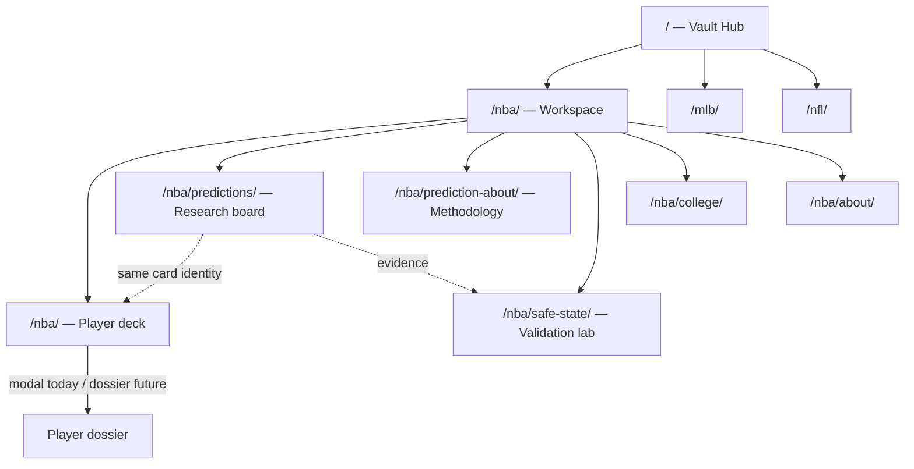

# The Card Vault System

**In The Cards Analytics** — unified UI language for a sports card vault meets analytics command center.

---

## 1. UI audit summary (current disconnects)

| Area | Issue | Impact |
|------|--------|--------|
| **Visual systems** | Hub (warm editorial), NBA (blue/amber analytics), NFL (purple scaffold) use separate `styles.css` files | Pages feel like three products |
| **Player representations** | Trading cards (`app.js`), wanted posters (`predictions.js`), safe-state cards (`safe-state.js`) | Same player looks different on each page |
| **Navigation** | Copy-pasted drawer HTML per page; links drift (e.g. safe-state missing on dashboard) | Broken continuity |
| **Taxonomy** | `card-families.yaml` exists for image pipeline but not web UI | Missed brand opportunity |
| **Wording** | “WANTED”, “REWARD”, “bounties” | Reads gambling-adjacent vs research |
| **Tables / validation** | Rich JSON in `data/` but no evidence-ledger UI | Trust signals hidden |
| **Player depth** | Modal-only dossier; no shareable player route | Card identity doesn’t “expand” |
| **CSS weight** | MLB ships full NBA deck CSS | Performance + maintenance debt |
| **Manifest** | `sports.json` / `site.json` labels and routes out of sync | Hub metadata unreliable |

**Direction:** One token layer, one `.player-card` component family, one shell, sport accents only where needed.

---

## 2. Design system: The Card Vault System

### Principles

1. **Card-first** — Every entity (player, pick, workspace, evidence row) is a card or card-row.
2. **Classification, not hype** — Chrome / Refractor / Blue Ice etc. encode *analytical profile*, not bet tiers.
3. **Four questions** — Who · Signal · Why · Reliability on every card.
4. **Uniform metrics** — Shared chips, confidence bands, freshness, status pills.
5. **Research framing** — Model lean, evidence strength, validation status.

### Token layers

- `vault-tokens.css` — color, type, space, motion, sport + variant accents
- `vault-components.css` — shell, doors, player cards, board, ledger, empty/skeleton
- `vault-components.js` — `CardVault.render*` helpers
- `vault-shell.js` — `CardVaultShell.mount`

### Card classification map (analytical)

| Variant | Meaning |
|---------|---------|
| Chrome | Baseline profile |
| Refractor | Stable / above-average signal |
| Retro | Historical / comparison context |
| Blue Ice | Strong fit / high-confidence edge |
| Zebra Ice | Unusual / rare context |
| Tiger Ice | Volatile, high-upside |
| Rookie | Low sample / new entrant |
| Manga | Star-level interest |
| Auto | High-value signal |
| Patch / Auto Patch | Premium dossier / strongest combined signal |

---

## 3. Route / page mapping



**Continuity keys:** `player_id` / name+team, `CardVault.renderPlayerCard`, shared variant + confidence, breadcrumb shell.

**Future routes (plug-in):** `/nba/player/{slug}/`, `/nba/validation/`, `/mlb/predictions/` — same vault assets under `/{sport}/vault/`.

---

## 4. Component implementation plan

| Component | Responsibility | Status |
|-----------|----------------|--------|
| `AppShell` → `CardVaultShell` | Top bar, sport switcher, breadcrumbs, disclaimer | **Live** on hub + NBA/MLB prediction boards |
| `SportWorkspaceCard` → `vault-door` + `renderSportWorkspaceCard` | Hub vault doors | **Live** on hub |
| `PlayerCard` → `.player-card` + `renderPlayerCard` | 8 contexts via props | **Live** on prediction boards |
| `PredictionCard` → `renderPredictionCard` | Board picks (NBA + MLB) | **Live** |
| `MetricChip` | Stat chips | Implemented |
| `ConfidenceBand` | A–D bands | Implemented |
| `EvidenceBadge` | Evidence count | Implemented |
| `StatusPill` | published / stale / withheld | Implemented |
| `DataFreshness` | Last updated | Implemented |
| `CardGrid` → `.vault-board` | Responsive grid | CSS ready |
| `StyledDataTable` → `.vault-ledger` | Evidence tables | CSS ready |
| `EmptyState` / `LoadingCardSkeleton` | Intentional states | Implemented |

**Next migrations:** NBA `app.js` trading cards → wrap or map to `renderPlayerCard`; safe-state → validation card context; MLB predictions → shared JS.

---

## 5. CSS / design token plan

See `sports/shared/web/vault/vault-tokens.css`:

- Surfaces: `--vault-bg-*`, `--vault-panel*`, `--vault-card-*`
- Type: `--vault-font-display` (Bebas Neue), `--vault-font-body` (DM Sans)
- Sport: `--vault-sport-accent` (set per workspace)
- Confidence: `--vault-conf-a` … `d`
- Variants: `--vault-variant-*`
- Motion: respects `prefers-reduced-motion`

Load order per page:

```html
<link rel="stylesheet" href="vault/vault-tokens.css">
<link rel="stylesheet" href="vault/vault-components.css">
<link rel="stylesheet" href="styles.css"> <!-- sport-specific overrides last -->
```

---

## 6. Example JSX/HTML structure

```html
<article class="player-card player-card--blue-ice player-card--compact player-card--prediction">
  <div class="player-card__edge"></div>
  <div class="player-card__foil"></div>
  <div class="player-card__strip">
    <span class="player-card__classification">Blue Ice</span>
    <span>Board #3</span>
  </div>
  <div class="player-card__body">
    <div class="player-card__identity">...</div>
    <p class="player-card__signal">Model lean: OVER · Line 24.5 · Projection 26.1</p>
    <p class="player-card__why">Context-supported edge on points. Review evidence before acting.</p>
    <div class="player-card__metrics">
      <span class="vault-metric-chip">...</span>
    </div>
  </div>
  <div class="player-card__footer">
    <span class="vault-confidence vault-confidence--b">...</span>
  </div>
</article>
```

Programmatic: `CardVault.renderPlayerCard({ ... })` / `CardVault.renderPredictionCard(play)`.

---

## 7. Example CSS (base + variants)

Implemented in `vault-components.css`:

- Base: `.player-card`, edge, foil, strip, body zones
- Variants: `.player-card--chrome` through `.player-card--patch`
- Premium shimmer: `.player-card--premium` + `@keyframes vault-shimmer`
- States: `--skeleton`, `--locked`, `--interactive`

---

## 8. Responsive behavior plan

| Breakpoint | Behavior |
|------------|----------|
| Desktop ≥1024px | Multi-column `.vault-board` / `.vault-door-grid`; full topbar |
| Tablet 721–1023px | 2-column grids; sport pills wrap |
| Mobile ≤720px | Single column; `vault-menu-btn` exposes workspace nav; 44px tap targets |

Cards: compact density on boards; dossier stacks avatar above metrics on narrow screens (future `@media` block in sport CSS).

---

## 9. Accessibility checklist

- [x] WCAG contrast on dark vault base (off-white on charcoal)
- [x] `aria-label` on player cards
- [x] Breadcrumb `aria-current="page"`
- [x] Focus outlines on interactive cards and CTAs
- [x] Confidence not color-only (band + text %)
- [x] `prefers-reduced-motion` disables hover tilt / shimmer duration
- [ ] Keyboard expand for ledger rows (migration pending)
- [ ] Live regions for filter/sort (migration pending)

---

## 10. Step-by-step migration plan

1. **Foundation (done)** — Add `sports/shared/web/vault/*`; build copies to `/vault/` and `/{sport}/vault/`. Run `python sports/shared/web/sync_vault.py` after editing canonical vault files for local dev.
2. **Hub (done)** — `vault-theme`, shell, `vault-door` grid via `CardVault.renderSportWorkspaceCard`.
3. **NBA + MLB predictions (done)** — Wanted posters replaced with `renderPredictionCard`; research-oriented copy.
4. **Shell rollout** — Add `#vaultShellRoot` + `CardVaultShell.mount` to remaining NBA/MLB HTML pages; unify nav links from `site.json`.
5. **NBA dashboard** — Map trading card render path to `renderPlayerCard` for grid; keep canvas charts in modal.
6. **Safe-state / validation** — Ledger layout + validation variant cards.
7. **MLB trim** — Drop unused NBA deck CSS; import vault only.
8. **NFL** — Vault door + scaffold pages.
9. **Player dossier route** — Optional `player.html` with `?id=` query using dossier density.
10. **Manifest sync** — Regenerate `sports.json`; align `route_labels` with nav.

**Non-breaking rule:** Legacy classes (`.trading-card`, `.wanted-card`) remain until each page migrates; new pages use vault only.

---

## File locations

| Asset | Path |
|-------|------|
| Tokens | `sports/shared/web/vault/vault-tokens.css` |
| Components CSS | `sports/shared/web/vault/vault-components.css` |
| Components JS | `sports/shared/web/vault/vault-components.js` |
| Shell JS | `sports/shared/web/vault/vault-shell.js` |
| Build hook | `sports/site/pipeline/build_static_site.py` → `sync_vault_assets()` |
